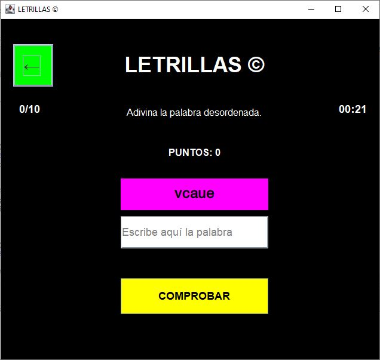
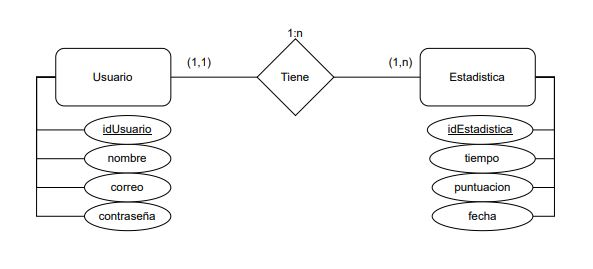
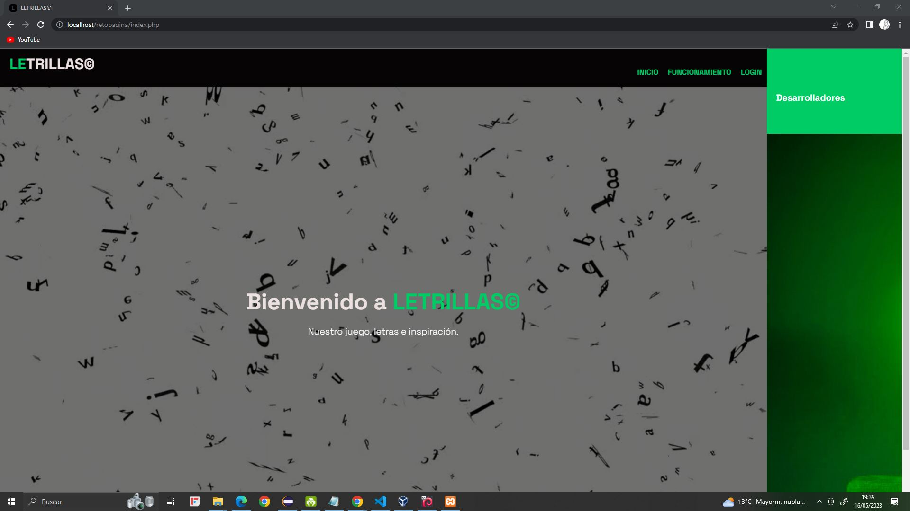

# **LETRILLAS©**

¡Bienvenido a LETRILLAS! El divertido juego de letras donde tendrás que adivinar palabras desordenadas. Cuantos menos fallos cometas, ¡más puntos obtendrás! Además, podrás competir con jugadores de todo el mundo y ver tu posición en el ranking global.

## Descripción del juego

LETRILLAS es un juego desarrollado en **Java** utilizando la librería **Swing**. El jugador deberá registrarse e iniciar sesión desde el juego o la página web para poder jugar. Una vez dentro, se presentarán palabras aleatorias en desorden, y el objetivo será adivinar la palabra correcta. Cuanto menos errores cometas en 10 rondas, más puntos obtendrás.

## Base de datos

Para almacenar las estadísticas de los jugadores, utilizamos una base de datos **MongoDB**. Hemos creado una base de datos en nuestro servidor, el cual está ubicado físicamente en nuestra clase, ya que somos estudiantes de **DAW**. Todas las estadísticas de los jugadores y sus datos se guardan en esta sencilla base de datos, permitiendo así consultar el ranking global.

## Página web oficial

Además del juego, contamos con la página web oficial de LETRILLAS. En esta página, los jugadores pueden consultar el ranking global y, si han iniciado sesión, también pueden ver sus propias estadísticas de forma individualizada. También es posible registrarse como nuevo jugador desde la página web.

La página web, al igual que la base de datos, están alojados en nuestro servidor. Hemos utilizado Docker para configurar Apache, PHP y MongoDB en el servidor, garantizando un entorno seguro y confiable para los usuarios.

## Cómo jugar

1. Clona el repositorio de LETRILLAS-GAME desde GitHub en tu dispositivo e importa el proyecto LETRILLAS-GAME en tu entorno de desarrollo preferido.
2. Asegúrate de que la librería "mongo-java-driver-3.12.13.jar" esté vinculada correctamente al proyecto, el cual también viene incluida en este repositorio.
3. Si deseas probar el juego en tu propio servidor o en tu propia máquina, deberás modificar la variable "host" en la clase "AccesoMongo.java".
4. Ejecuta la clase "Main.java" para abrir el juego y podrás registrarte como nuevo jugador si es tu primera vez o iniciar sesión con tu cuenta existente.
5. ¡Y listo! Una vez iniciada la sesión, podrás jugar.

No olvides que puedes consultar tus estadísticas con tu posición en el ranking global tanto desde el juego como desde la página web oficial de LETRILLAS.

Esperamos que disfrutes de LETRILLAS y te diviertas al máximo. ¡Buena suerte!
